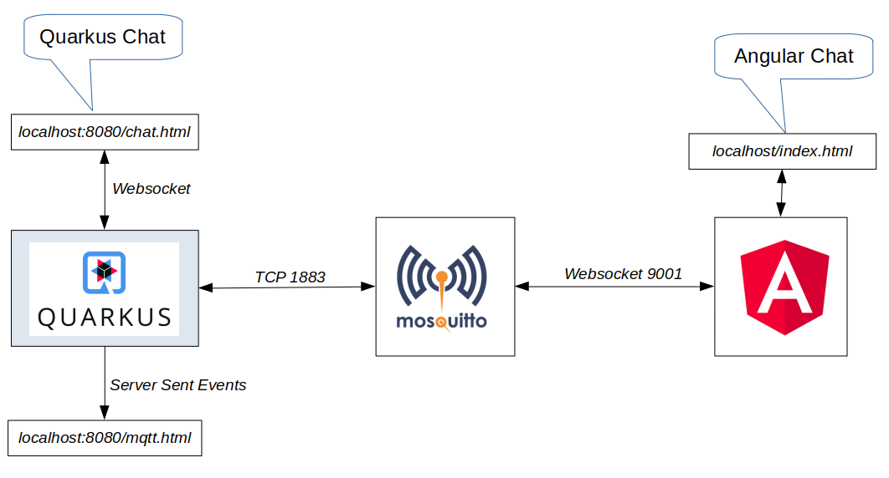
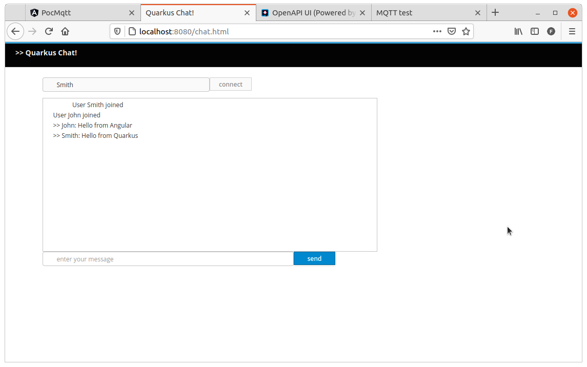
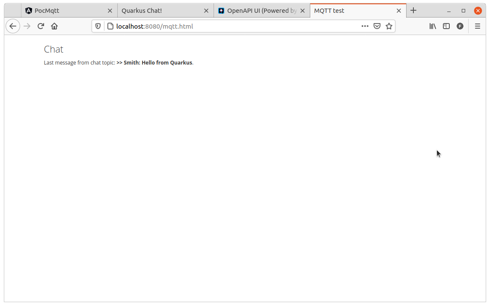
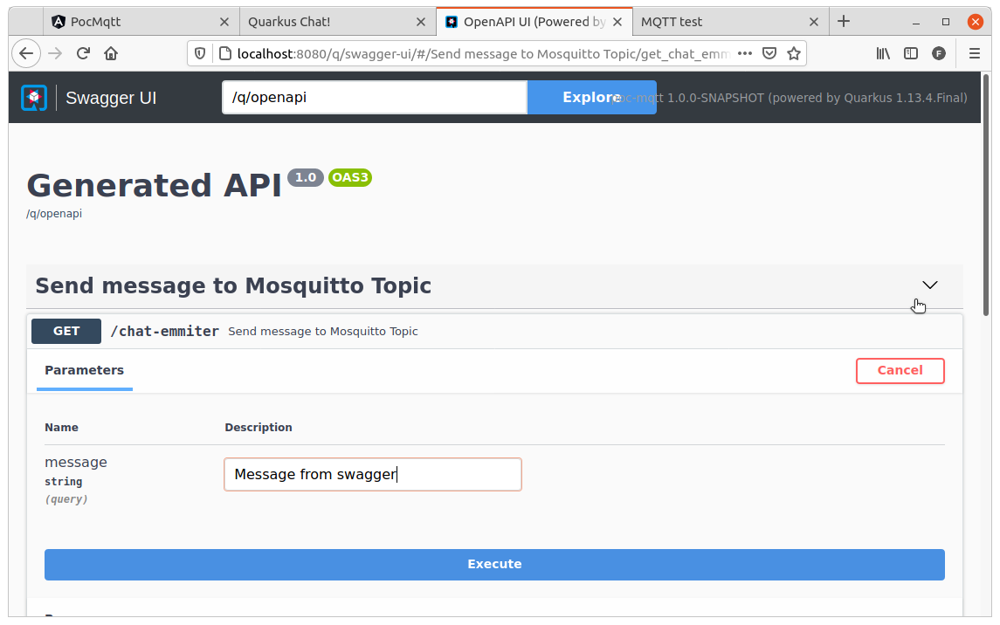
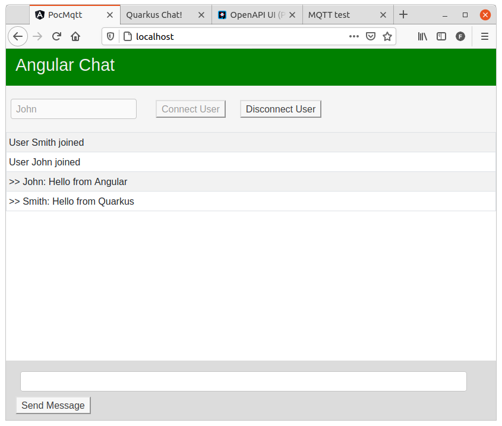

# poc-mosquitto-quarkus-angular

- [Overview](#overview)
- [Chat](#chat)
- [Fast Way to run the project](#Fast-way-to-run-the-project)
- [Building it locally and running with Docker](#Building-it-locally-and-running-with-Docker)
- [Running with development mode](#Running-with-development-mode)
- [Mosquitto](#Mosquitto)
- [Quarkus](#Quarkus)
- [Angular](#Angular)
- [Credits](#Credits)
- [Extras](#Extras)

# Overview

A POC to integrate Quarkus and Angular using Mosquitto.



# Chat

Just start the project and then acces the chat!

[Quarkus Chat](http://localhost:8080/chat.html)

[Angular Chat](http://localhost/)

# Fast way to run the project

Just bring up the following docker-compose.yml:
```yaml
version: "3.8"

services:
  mosquitto:
    container_name: mqtt-mosquitto
    image: felipewind/poc-mqtt-mosquitto:2.0.10
    restart: always
    networks:
      - poc-mqtt-net
    ports:
      - 1883:1883
      - 9001:9001

  quarkus:
    container_name: mqtt-quarkus
    image: felipewind/poc-mqtt-quarkus:1.0
    ports:
      - 8080:8080
    networks:
      - poc-mqtt-net
    depends_on:
      - mosquitto
    environment:
      - mp.messaging.outgoing.topic-send-chat.host=mosquitto
      - mp.messaging.incoming.topic-receive-chat.host=mosquitto

  angular:
    container_name: mqtt-angular
    image: felipewind/poc-mqtt-angular:1.0
    ports:
      - 80:80
    networks:
      - poc-mqtt-net
    depends_on:      
      - mosquitto

networks:
  poc-mqtt-net:
    driver: bridge
```

Or run `run-from-docker-hub.sh`.


# Building it locally and running with Docker

Run `run-with-local-build.sh`.


# Running with development mode

Start Mosquitto:
```
$ docker run -it -p 1883:1883 -p 9001:9001 --name mosquitto --rm felipewind/poc-mqtt-mosquitto:2.0.10
```

On the `angular` folder:
```
$ npm install
$ ng serve
```

On the `quarkus` folder:
```
$ mvn quarkus:dev
```


# Mosquitto 

Mosquitto is running providing TCP connection on port 1883 and Websocket connection on port 9001.

mosquitto.conf:
```
allow_anonymous true 

# this will listen for mqtt on tcp
listener 1883 0.0.0.0

# this will expect websockets connections
listener 9001 0.0.0.0
protocol websockets
```


# Quarkus

## Chat

Quarkus provides Websockets to its [chat](http://localhost:8080/chat.html).

You can open how many `Quarkus Chats` you want!

Every message received from the chat is published on the `chat` topic.

Every message received from the `chat` topic is broadcasted to the Websocket connection.



## MQTT tester

There's one [MQTT tester](http://localhost:8080/mqtt.html) where you can see the last message that was published to the `chat` topic.



## Swagger

It's possible to acces the [swagger](http://localhost:8080/q/swagger-ui/) and send one message directly to the `chat` topic.



# Angular

Angular communicates with Mosquitto using the Websockets protocol.

You can acces its [chat](http://localhost) and send and read the messages.



# Credits

## Mosquitto configuration

https://github.com/tiagostutz/eclipse-mosquitto-ws

https://stackoverflow.com/questions/34408624/how-do-i-enable-both-tcp-and-web-sockets-in-mosquitto

## Connect Angular with Mosquitto

https://medium.com/@anant.lalchandani/dead-simple-mqtt-example-over-websockets-in-angular-b9fd5ff17b8e

https://github.com/anantl05/angular-mqtt

## Providing Websockets and connecting to Mosquitto with Quarkus

https://github.com/quarkusio/quarkus-quickstarts/tree/main/websockets-quickstart

https://github.com/quarkusio/quarkus-quickstarts/tree/main/mqtt-quickstart

https://quarkus.io/blog/reactive-messaging-emitter/


# Extras

http://ddewaeletest.github.io/testblog/iot/mqtt/2015/09/21/building-mosquitto-with-websocket-support.html

http://www.steves-internet-guide.com/mqtt-websockets/

https://www.hivemq.com/blog/mqtt-essentials-special-mqtt-over-websockets/

## MQTT softwares

https://www.hivemq.com/

https://github.com/mqttjs/MQTT.js

https://github.com/eclipse/paho.mqtt.javascript

https://github.com/jpmens/simple-mqtt-websocket-example
- Uses Paho MQTT JavaScript client
- Just clone this project and open the index.html

## Web clients to test online

http://www.hivemq.com/demos/websocket-client/

https://mitsuruog.github.io/what-mqtt/
